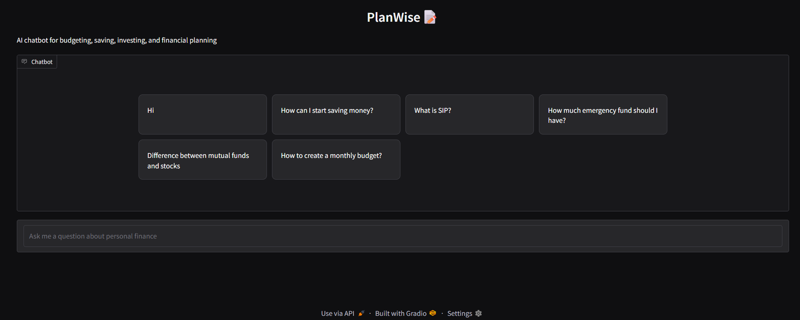
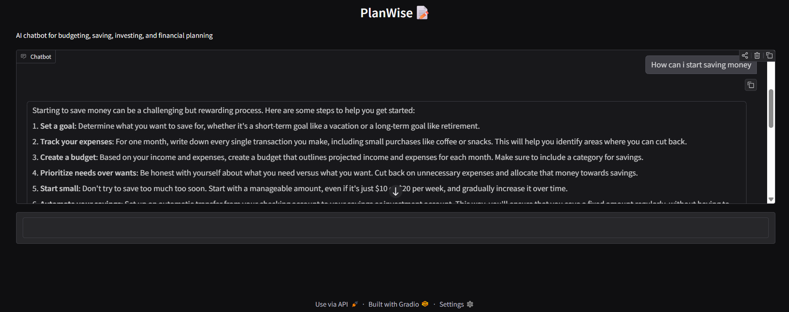

# 💰 PlanWise – AI Finance Assistant Chatbot

PlanWise is an AI-powered personal finance assistant that helps users understand and manage their finances through natural language conversations. The chatbot provides personalized financial guidance, expense insights, budgeting assistance, and investment suggestions using Large Language Models (LLMs).

Built with **Streamlit**, **Groq API**, and **Python**, PlanWise offers an intuitive and responsive interface for interacting with your financial data.

---

## 🚀 Features

- 💬 AI-powered financial chatbot
- 📊 Expense analysis and budgeting assistance
- 💰 Personalized savings recommendations
- 📈 Investment guidance and financial insights
- ⚡ Fast responses using Groq LLM
- 🎨 Simple and user-friendly Streamlit interface

---

## 🛠️ Tech Stack

- **Frontend:** Streamlit
- **Backend:** Python
- **LLM:** Groq API
- **Environment Management:** python-dotenv
- **Version Control:** Git & GitHub

---

## 📂 Project Structure

```
PlanWise/
│── app.py
│── chatbot.py
│── requirements.txt
│── .env
│── assets/
│   ├── screenshot1.png
│   └── screenshot2.png
└── README.md
```

---

## ⚙️ Installation

### 1. Clone the repository

```bash
git clone https://github.com/Neha7010/Planwise-AI-Finance-Assistant.git
cd Planwise-AI-Finance-Assistant
```

### 2. Create a virtual environment

```bash
python -m venv venv
```

Activate it:

**Windows**

```bash
venv\Scripts\activate
```

**Linux / macOS**

```bash
source venv/bin/activate
```

### 3. Install dependencies

```bash
pip install -r requirements.txt
```

### 4. Configure environment variables

Create a `.env` file in the project root:

```env
GROQ_API_KEY=your_groq_api_key
```

### 5. Run the application

```bash
streamlit run app.py
```

---

## 📸 Screenshots

### Chat Interface




---

### Chatbot response




---

## 📌 Future Improvements

- User authentication
- Expense tracking dashboard
- Financial report generation
- Voice-enabled chatbot
- Multi-language support
- AI-powered investment portfolio analysis

---


## 👩‍💻 Author

**Neha Kurian**

GitHub: https://github.com/Neha7010
```
